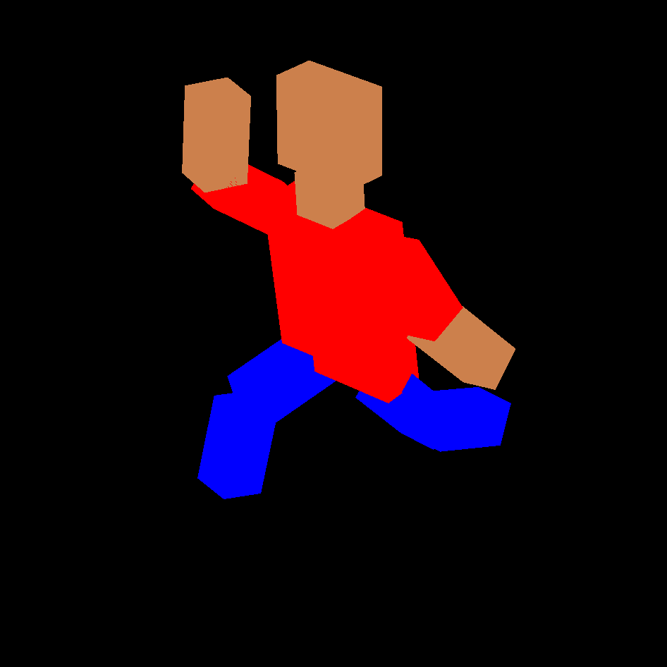
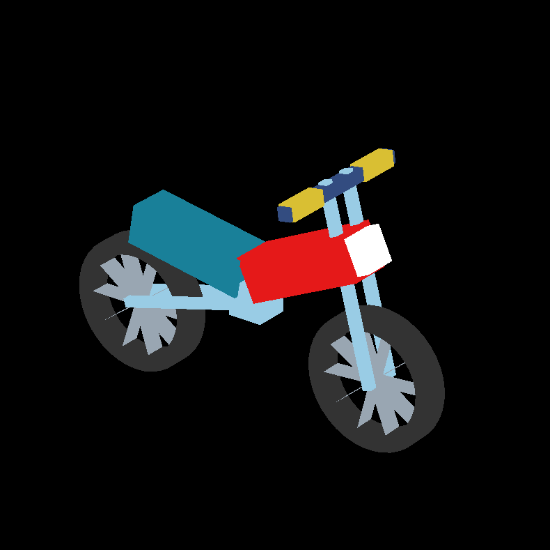
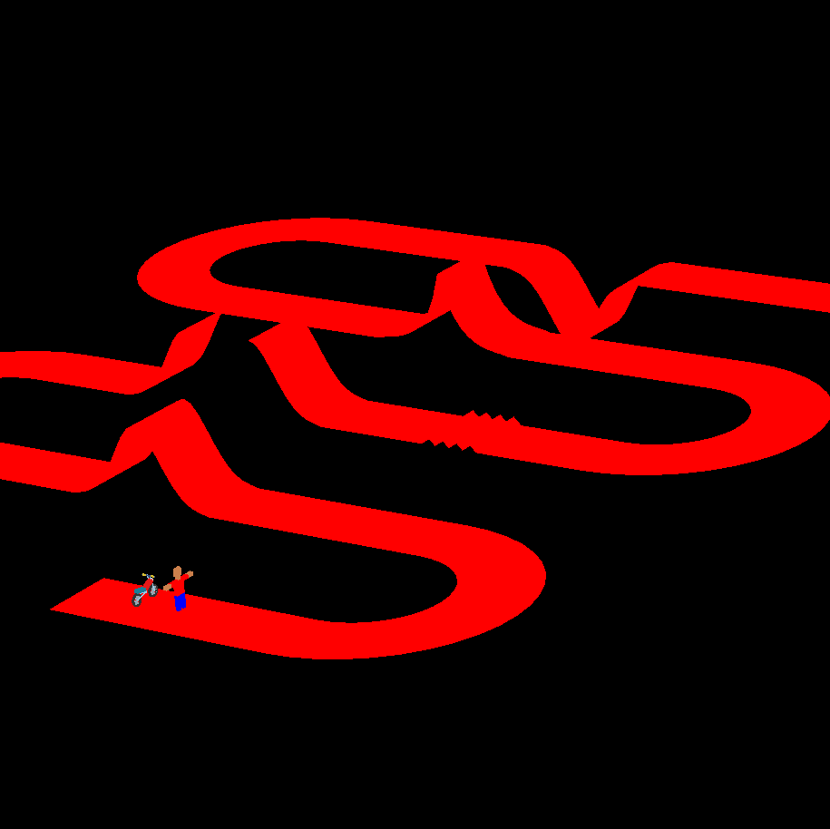
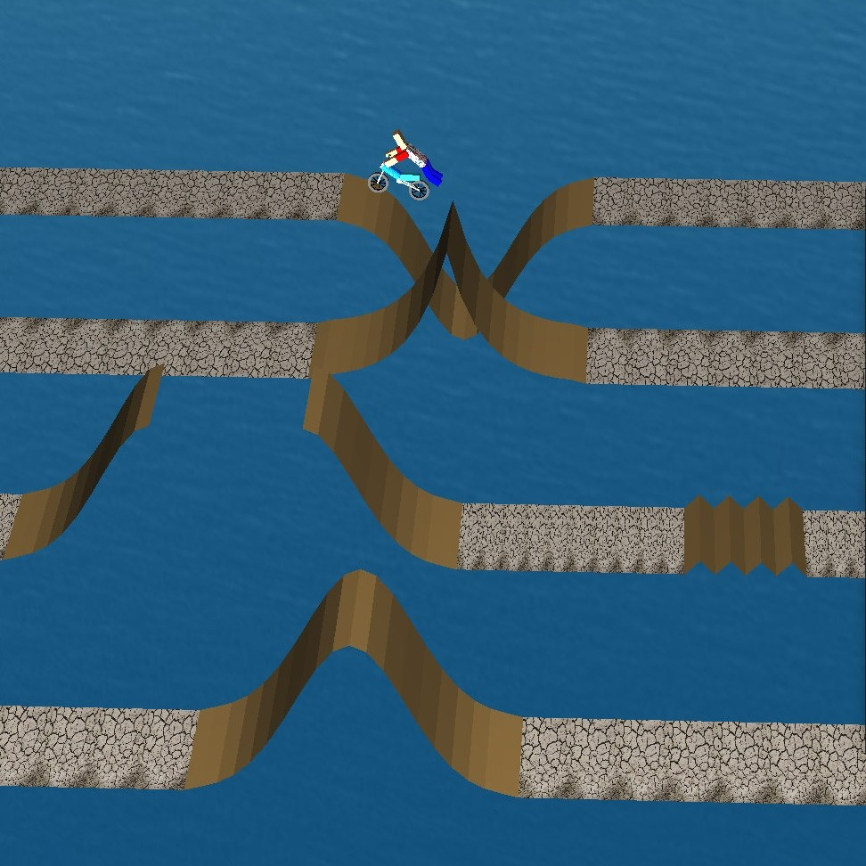

# FMX Animation

An application that models, renders, and animates a freestyle motocross (FMX) rider. 

[Here](https://youtu.be/RhG3SWKn6W8) is an animated video created using this application.

	 
	 
	
	

## Requirements
GLEW and GLFW. Follow [this](https://github.com/paragchaudhuri/cs475-tutorials/tree/master/Tutorial_00#before-you-begin) for installation instructions. 

## Running the code
- `make` to compile the neccesary files and create the executable(s) 
- `./fmx-animate` to start the application
- `make clean` to start afresh

## Collaborators
- Akkapaka Saikiran [[akkapakasaikiran](https://github.com/akkapakasaikiran)]
- Parth Vipul Sangani [[parthsangani00](https://github.com/parthsangani00)]

## Credits
- This project was done as part of CS 475, a course at IIT Bombay. 
	[[course page](https://www.cse.iitb.ac.in/~paragc/course/2020-cs475/)] [[showcase](https://sites.google.com/iitb.ac.in/cs475cs675-2020/home?authuser=0)]
- We made use of the [CS 475 Tutorials](https://github.com/paragchaudhuri/cs475-tutorials) for some of the base code. In particular, Tutorial 5 for Phong shading and Tutorial 7 for hierarchical modeling.
- We used the [STB](https://github.com/nothings/stb/) library to read and write into files and images.
- For shading and texturing, [Learn OpenGL](https://learnopengl.com/) was invaluable. 
- We used [babylonjs](https://doc.babylonjs.com/toolsAndResources/assetLibraries/availableTextures#cubetextures) for the environment maps. 
- We also referred to the official websites of [GLFW](https://www.glfw.org/) and [GLM](https://github.com/g-truc/glm).
- Music credits (in the animated video):
	- Achint Thakkar - [Scam 1992 Theme (Official)](https://youtu.be/BLeOcCeqsfI).
	- Vicetone & Tony Igy - [Astronomia](https://youtu.be/iLBBRuVDOo4). Popularized by the "Dancing Pallbearers" as the [Coffin Song](https://youtu.be/j9V78UbdzWI).

## Appendix: Keybindings
The rider and the bike can be manipulated (translated or rotated). 

- Choosing the object to be manipulated.
	- Rider
		| Object | Key |
		| --- | --- |
		| Whole scene | U |
		| Rider's imaginary hip | 0 |
		| Torso | T |
		| Neck | N |
		| Head | 1 |
		| Left Upper Arm | 2 |
		| Right Upper Arm | 3 |
		| Left Lower Arm | 4 |
		| Right Lower Arm | 5 |
		| Left Upper Leg | 6 |
		| Right Upper Leg | 7 |
		| Left Lower Leg | 8 |
		| Right Lower Leg | 9 |

	- Bike
		| Object | Key |
		| --- | --- |
		| Engine | G |
		| Front tire | H |
		| Back tire | I |
		| Handlebar | J |

- Rotation (some rotations are invalid for some objects)
	| Action | Key |
	| --- | --- |
	| About X-axis | UP, DOWN (arrow) |
	| About Y-axis | LEFT, RIGHT (arrow) |
	| About Z-axis | PageUp, PageDown |

- Translation
	| Action | Key |
	| --- | --- |
	| Along X-axis | A, B |
	| Along Y-axis | C, D |
	| Along Z-axis | E, F |

- Camera. There are three cameras in the application: global, third-person (follows the rider), and first-person (head-mounted on the rider).
	| Action | Key |
	| --- | --- |
	| Change camera | Z |
	| Zoom in | + |
	| Zoom out | - |

- Lights. There are four lights in the application. 
	| Action | Key |
	| --- | --- |
	| Toggle camera 1 (on/off) | K |
	| Toggle camera 2 (on/off) | M |
	| Toggle camera 3 (on/off) | O |
	| Toggle camera 4 (on/off) | Q |

-  ESC: Close the window

